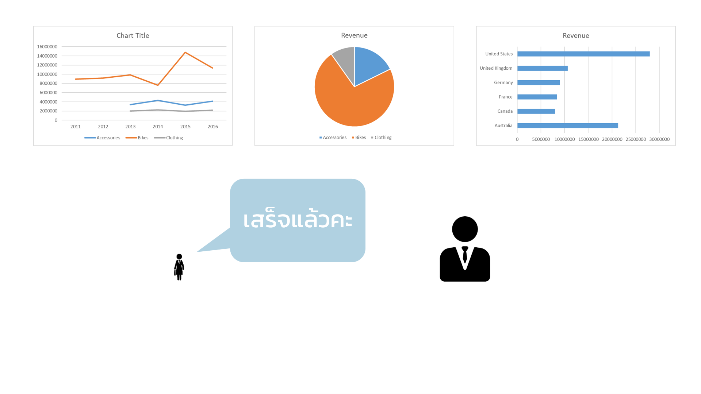
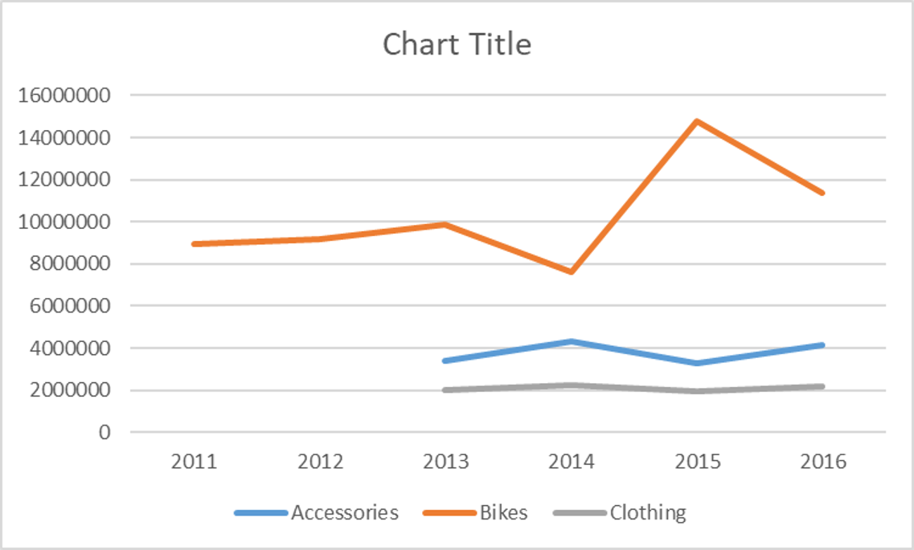
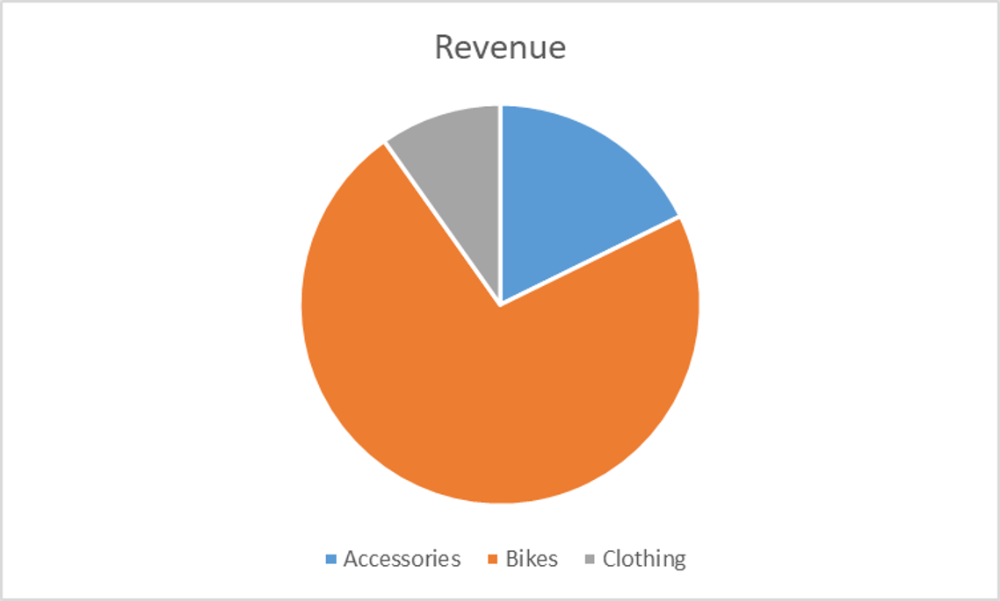
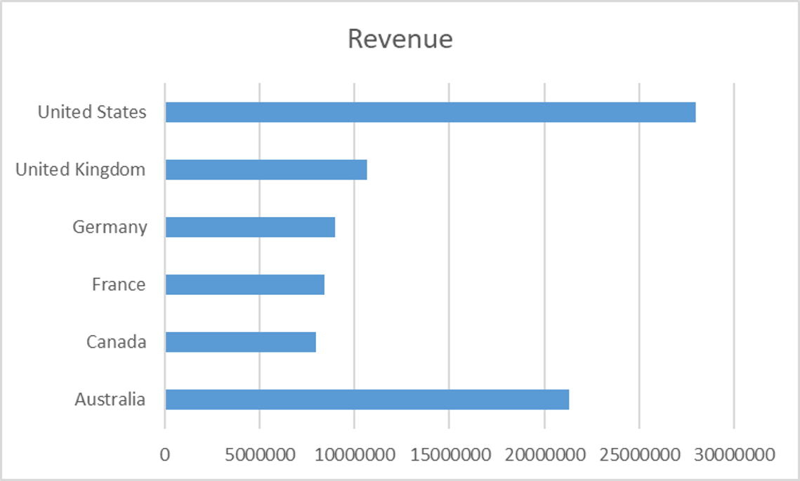
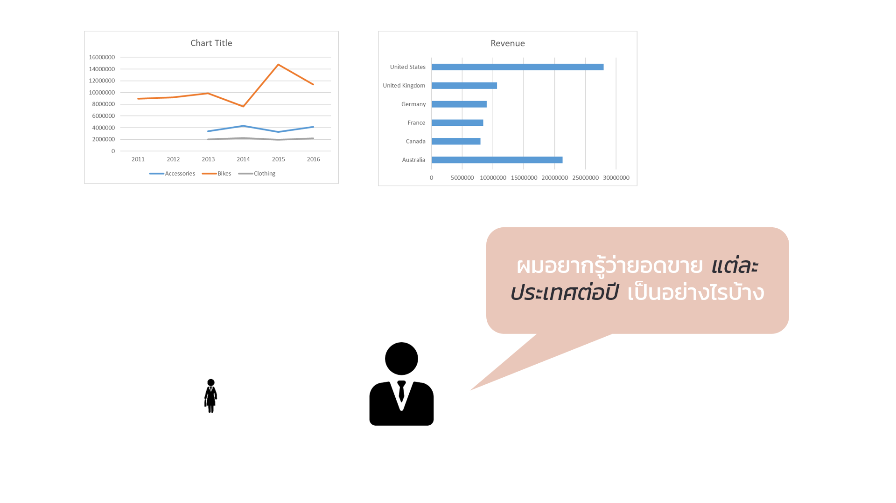

<!-- Slide Start -->

# Workshop Part 1

## Descriptive Analysis Using Pivot Table / Pivot Chart

---

---

---

---

# กิจกรรม - A1

- สร้างแผนภูมิต่อไปนี้

  
  
  

  

<iframe width="560" height="315" src="https://www.youtube.com/embed/o9CltPjbJcc?start=1&end=62" title="YouTube video player" frameborder="0" allow="accelerometer; autoplay; clipboard-write; encrypted-media; gyroscope; picture-in-picture" allowfullscreen></iframe>

---

---

---

---

---

# กิจกรรม - A2-1

- แปลงข้อมูลเป็น Excel Table
- ตั้งชื่อ Table ว่า `Sale`

  

<iframe width="560" height="315" src="https://www.youtube.com/embed/o9CltPjbJcc?start=62&end=108" title="YouTube video player" frameborder="0" allow="accelerometer; autoplay; clipboard-write; encrypted-media; gyroscope; picture-in-picture" allowfullscreen></iframe>

---

# กิจกรรม - A2-2

- สร้าง “Month” คอลัมน์
- สูตร `=TEXT([@Date],"mmmm")`

  

<iframe width="560" height="315" src="https://www.youtube.com/embed/o9CltPjbJcc?start=108&end=156" title="YouTube video player" frameborder="0" allow="accelerometer; autoplay; clipboard-write; encrypted-media; gyroscope; picture-in-picture" allowfullscreen></iframe>

---

# กิจกรรม - A2-3

- สร้าง “Age Group” column
  - Youth `(<25)`
    -Young Adults `(25-34)`
    -Adults `(35-64)`
    -Seniors `(>64)`
- สูตร
  `=IFS([@[Customer Age]]<25,"Youth",[@[Customer Age]]<35,"Young Adult", [@[Customer Age]] <65,"Adults",[@[Customer Age]]>=65,"Seniors")`

  

<iframe width="560" height="315" src="https://www.youtube.com/embed/o9CltPjbJcc?start=156&end=197" title="YouTube video player" frameborder="0" allow="accelerometer; autoplay; clipboard-write; encrypted-media; gyroscope; picture-in-picture" allowfullscreen></iframe>

---

# Older Version of Excel

`=IF([@[Customer Age]]<25,"Youth", IF([@[Customer Age]]<35,"Young Adult", IF([@[Customer Age]] <65,"Adults", IF([@[Customer Age]]>=65,"Seniors"))))`

---

# กิจกรรม - A2-4

- ลองใช้ Filter และ Sorting
- Tip
  - Filter ก่อนแล้วค่อย Sort มิฉะนั้นโปรแกรมจะค้าง

  

<iframe width="560" height="315" src="https://www.youtube.com/embed/o9CltPjbJcc?start=197&end=288" title="YouTube video player" frameborder="0" allow="accelerometer; autoplay; clipboard-write; encrypted-media; gyroscope; picture-in-picture" allowfullscreen></iframe>

---

# กิจกรรม - A3-1

- สร้าง Pivot table จาก `Sale` table
- Row
  - `Country`
- Values
  - `Order Quantity` (Sum of)
- Column
  - `Product Category`

  

<iframe width="560" height="315" src="https://www.youtube.com/embed/o9CltPjbJcc?start=288&end=356" title="YouTube video player" frameborder="0" allow="accelerometer; autoplay; clipboard-write; encrypted-media; gyroscope; picture-in-picture" allowfullscreen></iframe>

---

# กิจกรรม - A3-2

- Format ตัวเลขให้เป็น `Currency ($)`
- `Show Values As`
  - `% of Grand Total`
- ทดลองใช้ Filter และการ Sort

  

<iframe width="560" height="315" src="https://www.youtube.com/embed/o9CltPjbJcc?start=356&end=414" title="YouTube video player" frameborder="0" allow="accelerometer; autoplay; clipboard-write; encrypted-media; gyroscope; picture-in-picture" allowfullscreen></iframe>

---

# กิจกรรม - A4-1

- สร้าง Pivot table จาก `Sale` table
- Row
  - `Year`
  - `Month`
- Values
  - `Revenue` (Sum of)
- Column
  - `Product Category`

  

<iframe width="560" height="315" src="https://www.youtube.com/embed/o9CltPjbJcc?start=414&end=494" title="YouTube video player" frameborder="0" allow="accelerometer; autoplay; clipboard-write; encrypted-media; gyroscope; picture-in-picture" allowfullscreen></iframe>

---

# กิจกรรม - A4-2

- Format ตัวเลขให้เป็น `Currency ($)`
- ทดลองใช้
  - Expand / collapse
  - Filter
  - Fort

  

<iframe width="560" height="315" src="https://www.youtube.com/embed/o9CltPjbJcc?start=494&end=587" title="YouTube video player" frameborder="0" allow="accelerometer; autoplay; clipboard-write; encrypted-media; gyroscope; picture-in-picture" allowfullscreen></iframe>

---

# กิจกรรม - A5-1

- สร้าง Pivot chart
- Bar chart
  - `Revenue` vs `Country`

  

<iframe width="560" height="315" src="https://www.youtube.com/embed/o9CltPjbJcc?start=587&end=631" title="YouTube video player" frameborder="0" allow="accelerometer; autoplay; clipboard-write; encrypted-media; gyroscope; picture-in-picture" allowfullscreen></iframe>

---

# กิจกรรม - A5-2

- สร้าง Pivot chart
- Line chart
  - `Revenue` vs `Date`

  

<iframe width="560" height="315" src="https://www.youtube.com/embed/o9CltPjbJcc?start=631&end=660" title="YouTube video player" frameborder="0" allow="accelerometer; autoplay; clipboard-write; encrypted-media; gyroscope; picture-in-picture" allowfullscreen></iframe>

---

# กิจกรรม - A5-3

- จัด Layout
  - `Move pivot table`

  

<iframe width="560" height="315" src="https://www.youtube.com/embed/o9CltPjbJcc?start=660&end=737" title="YouTube video player" frameborder="0" allow="accelerometer; autoplay; clipboard-write; encrypted-media; gyroscope; picture-in-picture" allowfullscreen></iframe>

---

# กิจกรรม - A5-4

- ทดลอง
  - Filter
  - Expand / collapse `Date`

  

<iframe width="560" height="315" src="https://www.youtube.com/embed/o9CltPjbJcc?start=737&end=835" title="YouTube video player" frameborder="0" allow="accelerometer; autoplay; clipboard-write; encrypted-media; gyroscope; picture-in-picture" allowfullscreen></iframe>

---

# กิจกรรม - A6-1

- สร้าง `Timeline`
  - Interactive filter
- Tip
  - เพิ่มเนื้อที่ด้านบนโดยการขยายแถวแรก
  - ปิด `View` -> `grid`

  

<iframe width="560" height="315" src="https://www.youtube.com/embed/o9CltPjbJcc?start=835&end=941" title="YouTube video player" frameborder="0" allow="accelerometer; autoplay; clipboard-write; encrypted-media; gyroscope; picture-in-picture" allowfullscreen></iframe>

---

# กิจกรรม - A6-2

- ใช้ `Report Connect` ทำให้ Filter เชื่อมต่อกับ Pivot Table ทั้งสองอัน

  

<iframe width="560" height="315" src="https://www.youtube.com/embed/o9CltPjbJcc?start=941&end=1013" title="YouTube video player" frameborder="0" allow="accelerometer; autoplay; clipboard-write; encrypted-media; gyroscope; picture-in-picture" allowfullscreen></iframe>

---

# กิจกรรม - A7-1

- สร้าง Slicer
  - `Product category`
- ใช้ `Report Connect` ทำให้ Slicer เชื่อมต่อกับ Pivot Table ทั้งสองอัน

  

<iframe width="560" height="315" src="https://www.youtube.com/embed/o9CltPjbJcc?start=1013&end=1084" title="YouTube video player" frameborder="0" allow="accelerometer; autoplay; clipboard-write; encrypted-media; gyroscope; picture-in-picture" allowfullscreen></iframe>

---

# กิจกรรม - A7-2

- สร้าง Slicer

  - `Age group`
  - `Customer gender`

- ใช้ `Report Connect` ทำให้ Slicer เชื่อมต่อกับ Pivot Table ทั้งสองอัน

  

<iframe width="560" height="315" src="https://www.youtube.com/embed/o9CltPjbJcc?start=1084&end=1153" title="YouTube video player" frameborder="0" allow="accelerometer; autoplay; clipboard-write; encrypted-media; gyroscope; picture-in-picture" allowfullscreen></iframe>

---

# กิจกรรม - A8

- ในข้อมูลดิบ สร้างคอลัมน์
  - `Profit = Revenue – Cost`
  - `Margin = Profit / Revenue`

  

<iframe width="560" height="315" src="https://www.youtube.com/embed/o9CltPjbJcc?start=1153&end=1247" title="YouTube video player" frameborder="0" allow="accelerometer; autoplay; clipboard-write; encrypted-media; gyroscope; picture-in-picture" allowfullscreen></iframe>

---

# กิจกรรม - A9-1

- สร้าง Pivot Table จาก `Sale` Table
- Row
  - `Product category`
  - `Sub category`
- Values
  - `Order Quantity`
  - `Revenue`
  - `Profit`
  - `Margin`

  

<iframe width="560" height="315" src="https://www.youtube.com/embed/o9CltPjbJcc?start=1247&end=1331" title="YouTube video player" frameborder="0" allow="accelerometer; autoplay; clipboard-write; encrypted-media; gyroscope; picture-in-picture" allowfullscreen></iframe>

---

# กิจกรรม - A9-2

- Format
- `Order Quantity`
  - `Show Values As` -> `% of Grand Total`
- `Revenue`, `Profit`
  - `Number format` -> `Currency ($)`
- `Margin`
  - `Number format` -> `Percent`
  

    

<iframe width="560" height="315" src="https://www.youtube.com/embed/o9CltPjbJcc?start=1331&end=1414" title="YouTube video player" frameborder="0" allow="accelerometer; autoplay; clipboard-write; encrypted-media; gyroscope; picture-in-picture" allowfullscreen></iframe>

---

# Margin

- สิ่งที่ควรจะเป็น
  - $\text{Margin}=\frac{\Sigma (\text{Profit}) }{\Sigma (\text{Revenue})}$
- สิ่งที่เกิดขึ้น
  - $\text{Margin}= \Sigma \Big( \frac{\text{Profit}}{\text{Revenue}} \Big)$
- แก้ไขโดยใช้ `Calculated Field`

---

# กิจกรรม - A9-3

  

- ลบคอลัมน์ `Margin` จาก Pivot Table และ Table
- Refresh ข้อมูล

  - `PivotTable Analze` -> `Refresh`

    

    

      <iframe width="560" height="315" src="https://www.youtube.com/embed/o9CltPjbJcc?start=1414&end=1451" title="YouTube video player" frameborder="0" allow="accelerometer; autoplay; clipboard-write; encrypted-media; gyroscope; picture-in-picture" allowfullscreen></iframe>
    

  

---

# กิจกรรม - A10-1

  

- สร้าง Calculated Field `Profit2`
- ไปที่
  - `PivotTable Analyze` -> `Fields, Items, & Sets` -> `Calculated Field...`
- Formula

  - `Profit2 = Revenue – Cost`

    

    

      <iframe width="560" height="315" src="https://www.youtube.com/embed/o9CltPjbJcc?start=1451&end=1547" title="YouTube video player" frameborder="0" allow="accelerometer; autoplay; clipboard-write; encrypted-media; gyroscope; picture-in-picture" allowfullscreen></iframe>
    

  

---

# กิจกรรม - A10-2

  

- สร้าง Calculated Field `Margin`
- Formula
  - `Margin = Profit / Revenue`
  - `Margin = Profit2 / Revenue`
- Format
  - `Percent`
    

    

      <iframe width="560" height="315" src="https://www.youtube.com/embed/o9CltPjbJcc?start=1547&end=1625" title="YouTube video player" frameborder="0" allow="accelerometer; autoplay; clipboard-write; encrypted-media; gyroscope; picture-in-picture" allowfullscreen></iframe>
    

  

---

# กิจกรรม - A11

  

- ใช้ `Conditional formatting`

  - `Order Quantity`: Gradient
  - `Profit`: Color

    

    

      <iframe width="560" height="315" src="https://www.youtube.com/embed/o9CltPjbJcc?start=1625" title="YouTube video player" frameborder="0" allow="accelerometer; autoplay; clipboard-write; encrypted-media; gyroscope; picture-in-picture" allowfullscreen></iframe>
    

  

