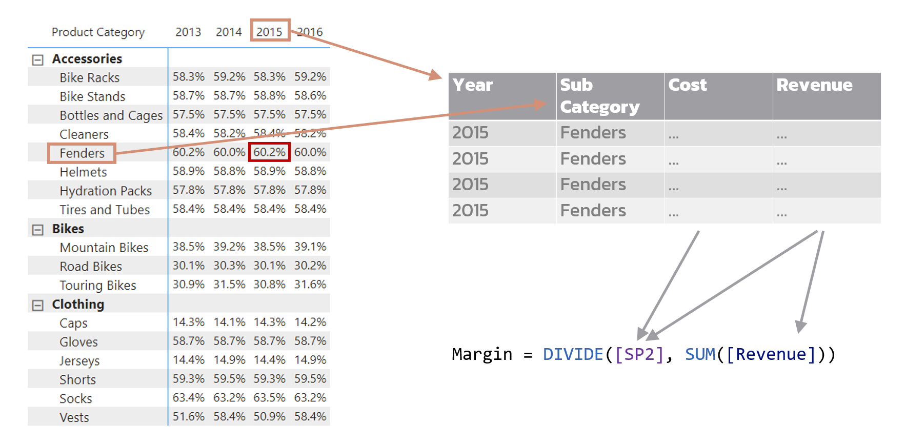
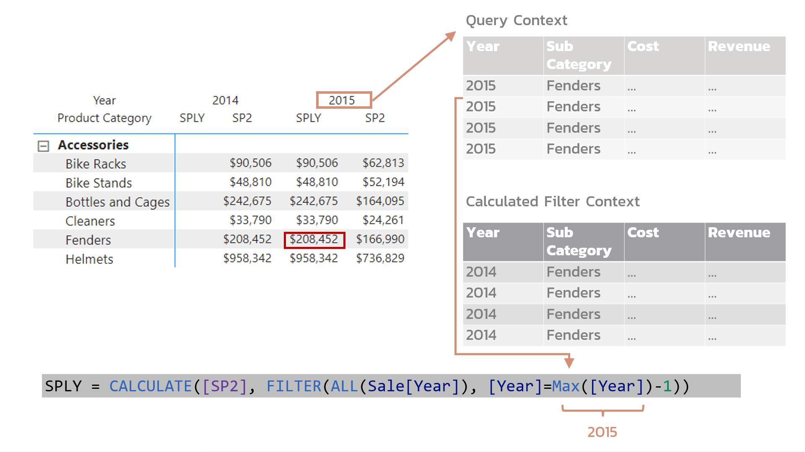

<!-- Slide Start -->

# Workshop Part 2

## Descriptive Analysis Using Power BI

---

# ปัญหา

- ไม่สามารถรวม Table หลายๆ อันได้
  - ต้องใช้ `VLOOPUP` ทำให้ตารางใหญ่ขึ้นเรื่อยๆ
- ข้อจำกัดในการคำนวณ
  - % Growth ของ `Revenue`

---

# เครื่องมือ

- Power Pivot
  - Microsoft Excel 2016 ขึ้นไป
  - Microsoft 365
- Tableau
  - แพง
- Power BI Desktop
  - Free
  - PC Only

---

# Power BI vs Power BI Desktop

- `Power BI`
  - บริการ Business Analytics ของบริษัท Microsoft.
  - มีหลายผลิตภัณฑ์
- `Power BI Desktop`
  - ผลิตภัณฑ์หนึ่งของ บริการ `Power BI`
  - โปรแกรมใช้ใน PC เพื่อออกแบบ Dashboard และทำ Business Analytics

## 

---

# กิจกรรม - B1

  

- นำเข้าข้อมูล `Sale` จาก `Sale.xlsx`

  - `File` -> `Get data` -> `Excel workbook`
  - เลือก ไฟล์ `Sale.xlsx`
  - กด `Load`

    

    

    <iframe width="560" height="315" src="https://www.youtube.com/embed/B2mcUr62EwE?start=1&end=71" title="YouTube video player" frameborder="0" allow="accelerometer; autoplay; clipboard-write; encrypted-media; gyroscope; picture-in-picture" allowfullscreen></iframe>
    

  

---

# กิจกรรม - B2-1

  

- สร้าง คอลัมน์ `Month`

- `Data` -> `Table tools` -> `New column`

- สูตร

  - `Month = MONTH([date])`

    

    

    <iframe width="560" height="315" src="https://www.youtube.com/embed/B2mcUr62EwE?start=71&end=147" title="YouTube video player" frameborder="0" allow="accelerometer; autoplay; clipboard-write; encrypted-media; gyroscope; picture-in-picture" allowfullscreen></iframe>
    

  

---

# กิจกรรม - B2-2

  

- สร้าง คอลัมน์ `Age Group`
- `Data` -> `Table tools` -> `New column`
- `Age Group = SWITCH(TRUE(), [Customer Age] < 25, "Youth", AND([Customer Age] >= 25, [Customer Age]<35), "Young Adult", AND([Customer Age] >= 35, [Customer Age]<65), "Adult", [Customer Age]>=65, "Senior", BLANK() )`

<iframe width="560" height="315" src="https://www.youtube.com/embed/B2mcUr62EwE?start=147&end=192" title="YouTube video player" frameborder="0" allow="accelerometer; autoplay; clipboard-write; encrypted-media; gyroscope; picture-in-picture" allowfullscreen></iframe>
  

---

# กิจกรรม - B3

  

- นำเข้าข้อมูล `Customer Demographic`
  - `File` -> `Get data` -> `Text/CSV`
  - เลือก ไฟล์ `Demo.csv`
  - `Load`

<iframe width="560" height="315" src="https://www.youtube.com/embed/B2mcUr62EwE?start=192&end=254" title="YouTube video player" frameborder="0" allow="accelerometer; autoplay; clipboard-write; encrypted-media; gyroscope; picture-in-picture" allowfullscreen></iframe>
  

---

# กิจกรรม - B4-1

  

- ทดลองสร้าง Relationship ใหม่

  - ลบ `Relationship` เดิมออก
  - ลาก `Customer ID` ไปทับอีกอัน

<iframe width="560" height="315" src="https://www.youtube.com/embed/B2mcUr62EwE?start=254&end=337" title="YouTube video player" frameborder="0" allow="accelerometer; autoplay; clipboard-write; encrypted-media; gyroscope; picture-in-picture" allowfullscreen></iframe>
  

---

# กิจกรรม - B4-2

  

- ลองสร้าง `Column` ใหม่ใน Sale ที่มาจาก `Demo` Table
- `Data` -> `Table tools` -> `New column`

- สูตร
  - `MartialStatus = RELATED(Demo[MaritalStatus])`
  - สามารถลบออกได้ไม่จำเป็นต้องมี

<iframe width="560" height="315" src="https://www.youtube.com/embed/B2mcUr62EwE?start=337&end=427" title="YouTube video player" frameborder="0" allow="accelerometer; autoplay; clipboard-write; encrypted-media; gyroscope; picture-in-picture" allowfullscreen></iframe>
  

---

# กิจกรรม - B5-1

  

- สร้าง Line Chart
- Axis
  - `Date`
- Legend
  - `Product Category`
- Values
  - `Revenue`

<iframe width="560" height="315" src="https://www.youtube.com/embed/B2mcUr62EwE?start=427&end=525" title="YouTube video player" frameborder="0" allow="accelerometer; autoplay; clipboard-write; encrypted-media; gyroscope; picture-in-picture" allowfullscreen></iframe>
  

---

# กิจกรรม - B5-2

  

- Format value ให้เป็น `Currency ($)`
- `Data` -> `Column tools` -> `Format`

<iframe width="560" height="315" src="https://www.youtube.com/embed/B2mcUr62EwE?start=525&end=578" title="YouTube video player" frameborder="0" allow="accelerometer; autoplay; clipboard-write; encrypted-media; gyroscope; picture-in-picture" allowfullscreen></iframe>
  

---

# กิจกรรม - B5-3

  

- ทดลอง ปุ่มต่างๆใน Visual
  - `Go to the next level in the hierarchy`
  - `Expand all down one level in the hierarchy`
  - `Drill down`
  - `Show as table`

<iframe width="560" height="315" src="https://www.youtube.com/embed/B2mcUr62EwE?start=578&end=769" title="YouTube video player" frameborder="0" allow="accelerometer; autoplay; clipboard-write; encrypted-media; gyroscope; picture-in-picture" allowfullscreen></iframe>
  

---

# กิจกรรม - B6-1

  

- สร้าง Stacked Bar Chart
- Axis
  - `Country`
- Legend
  - `Product Category`
- Values
  - `Revenue`

<iframe width="560" height="315" src="https://www.youtube.com/embed/B2mcUr62EwE?start=769&end=823" title="YouTube video player" frameborder="0" allow="accelerometer; autoplay; clipboard-write; encrypted-media; gyroscope; picture-in-picture" allowfullscreen></iframe>
  

---

# กิจกรรม - B6-2

  

- ทดลองการ `Cross Filtering`
- ทดลอง `Drilling Down` ใน Line Chart

<iframe width="560" height="315" src="https://www.youtube.com/embed/B2mcUr62EwE?start=823&end=902" title="YouTube video player" frameborder="0" allow="accelerometer; autoplay; clipboard-write; encrypted-media; gyroscope; picture-in-picture" allowfullscreen></iframe>
  

---

# กิจกรรม - B7-1

  

- เพิ่ม Slicer
- Values
  - `Date`

<iframe width="560" height="315" src="https://www.youtube.com/embed/B2mcUr62EwE?start=902&end=994" title="YouTube video player" frameborder="0" allow="accelerometer; autoplay; clipboard-write; encrypted-media; gyroscope; picture-in-picture" allowfullscreen></iframe>
  

---

# กิจกรรม - B7-2

  

- เพิ่ม 3 Slicers
- Values
  - `Age Group`
  - `Customer Gender`
  - `Yearly Income`

<iframe width="560" height="315" src="https://www.youtube.com/embed/B2mcUr62EwE?start=994&end=1067" title="YouTube video player" frameborder="0" allow="accelerometer; autoplay; clipboard-write; encrypted-media; gyroscope; picture-in-picture" allowfullscreen></iframe>
  

---

# กิจกรรม - B8

  

- เพิ่ม Card
- Values
  - `Customer ID`

<iframe width="560" height="315" src="https://www.youtube.com/embed/B2mcUr62EwE?start=1067&end=1120" title="YouTube video player" frameborder="0" allow="accelerometer; autoplay; clipboard-write; encrypted-media; gyroscope; picture-in-picture" allowfullscreen></iframe>
  

---

# กิจกรรม - B9-1

  

- สร้าง Profit column
- `Data` -> `Table tools` -> `New column`
- สูตร
  - `Profit = [Revenue]-[Cost]`

<iframe width="560" height="315" src="https://www.youtube.com/embed/B2mcUr62EwE?start=1120&end=1178" title="YouTube video player" frameborder="0" allow="accelerometer; autoplay; clipboard-write; encrypted-media; gyroscope; picture-in-picture" allowfullscreen></iframe>
  

---

# กิจกรรม - B9-2

  

- Format `Profit` ให้เป็น `Currency ($)`
- `Column tools` -> `Format`

<iframe width="560" height="315" src="https://www.youtube.com/embed/B2mcUr62EwE?start=1178&end=1201" title="YouTube video player" frameborder="0" allow="accelerometer; autoplay; clipboard-write; encrypted-media; gyroscope; picture-in-picture" allowfullscreen></iframe>
  

---

# กิจกรรม - B9-3

  

- สร้าง Matrix ใน `Page` ใหม่
- Row
  - `Product category`
  - `Sub Category`
- Columns
  - `Year` (not date)
- Values
  - `Profit`

<iframe width="560" height="315" src="https://www.youtube.com/embed/B2mcUr62EwE?start=1201&end=1284" title="YouTube video player" frameborder="0" allow="accelerometer; autoplay; clipboard-write; encrypted-media; gyroscope; picture-in-picture" allowfullscreen></iframe>
  

---

# กิจกรรม - B9-4

  

- Format Matrix
- เปลี่ยน `Text size` โดยการให้ Search
  - 14 pt
- `Column headers` -> `Alignment` -> `Center`

<iframe width="560" height="315" src="https://www.youtube.com/embed/B2mcUr62EwE?start=1284&end=1395" title="YouTube video player" frameborder="0" allow="accelerometer; autoplay; clipboard-write; encrypted-media; gyroscope; picture-in-picture" allowfullscreen></iframe>
  

---

# Measure

- รวมค่า (Aggregation) จากหลายๆแถว เพื่อทำการคำนวณในรูปแบบต่างๆเช่น
  - Sum
  - Count
  - Average
- เหมือนกับ `Calculated Field` ใน Excel
  - แต่สามารถเขียนสูตรได้ซับซ้อนกว่า

---

# กิจกรรม - B10-1

  

- สร้าง Measure `SP1` (Sum of Profit)
- `Data` -> `Table tools` -> `New measure`
- สูตร
  - `SP1 = sum([Profit])`

<iframe width="560" height="315" src="https://www.youtube.com/embed/B2mcUr62EwE?start=1395&end=1455" title="YouTube video player" frameborder="0" allow="accelerometer; autoplay; clipboard-write; encrypted-media; gyroscope; picture-in-picture" allowfullscreen></iframe>
  

---

# กิจกรรม - B10-2

  

- เพิ่ม Measure `SP1` ลงใน Matrix
- Format ข้อมูลให้เป็น `Currency ($)`

<iframe width="560" height="315" src="https://www.youtube.com/embed/B2mcUr62EwE?start=1455&end=1515" title="YouTube video player" frameborder="0" allow="accelerometer; autoplay; clipboard-write; encrypted-media; gyroscope; picture-in-picture" allowfullscreen></iframe>
  

---

# กิจกรรม - B10-3

  

- สร้าง Measure `SP2` (Sum of Profit)
- `Data` -> `Table tools` -> `New measure`
- สูตร
  - `SP2 = sumx(Sale, [Revenue]- [Cost])`
- เพิ่ม Measure `SP2` ลงใน Matrix
- Format ข้อมูลให้เป็น `Currency ($)`

<iframe width="560" height="315" src="https://www.youtube.com/embed/B2mcUr62EwE?start=1515&end=1624" title="YouTube video player" frameborder="0" allow="accelerometer; autoplay; clipboard-write; encrypted-media; gyroscope; picture-in-picture" allowfullscreen></iframe>
  

---

# กิจกรรม - B11-1

  

- สร้าง Measure `Margin`
- `Data` -> `Table tools` -> `New measure`
- สูตร
  - `Margin = DIVIDE([SP1], SUM([Revenue]))`
  - `Margin = DIVIDE([SP2], SUM([Revenue]))`
- Format ให้เป็น `Percent`
  

  

  <iframe width="560" height="315" src="https://www.youtube.com/embed/B2mcUr62EwE?start=1624&end=1708" title="YouTube video player" frameborder="0" allow="accelerometer; autoplay; clipboard-write; encrypted-media; gyroscope; picture-in-picture" allowfullscreen></iframe>
    

  

---

# กิจกรรม - B11-2

  

- เพิ่ม Measure `Margin` ลงใน Matrix

  

  

  <iframe width="560" height="315" src="https://www.youtube.com/embed/B2mcUr62EwE?start=1708&end=1743" title="YouTube video player" frameborder="0" allow="accelerometer; autoplay; clipboard-write; encrypted-media; gyroscope; picture-in-picture" allowfullscreen></iframe>
    

  

---

# Data Analysis Expression (DAX)

- ภาษาในการสร้างสูตรคำนวณใน
  - Microsoft PowerPivot
  - Power BI Desktop
  - SQL Server Analysis Services (SSAS)

---

# Query Context

---

# กิจกรรม - B12

  

- เพิ่ม Measure `SPLY` (Sum of Profit from Last Year)
- `Data` -> `Table tools` -> `New measure`
- สูตร

  - `SPLY = CALCULATE([SP2], FILTER(ALL(Sale[Year]), [Year]=Max([Year])-1))`

- เพิ่ม Measure `SPLY` ลงใน Matrix
  

  

  <iframe width="560" height="315" src="https://www.youtube.com/embed/B2mcUr62EwE?start=1743&end=1939" title="YouTube video player" frameborder="0" allow="accelerometer; autoplay; clipboard-write; encrypted-media; gyroscope; picture-in-picture" allowfullscreen></iframe>
    

  

---

---

# กิจกรรม - B13

  

- เพิ่ม Measure `YPG` (Yearly profit growth)
- `Data` -> `Table tools` -> `New measure`
- สูตร

  - `YPG = DIVIDE([SP2]-[SPLY], [SPLY])`

- Format ค่าให้เป็น `Percent`

- เพิ่ม Measure `YPG` ลงใน Matrix

    

    

    <iframe width="560" height="315" src="https://www.youtube.com/embed/B2mcUr62EwE?start=1939" title="YouTube video player" frameborder="0" allow="accelerometer; autoplay; clipboard-write; encrypted-media; gyroscope; picture-in-picture" allowfullscreen></iframe>
      

    

---

# กิจกรรม – ท้ายบท

- สร้าง Dashboard สำหรับข้อมูล การส่งสินค้าของ Shopee
  - ประเทศฟิลิปปินส์
  - ในช่วง มีนาคม 2563 - เมษายน 2563
  - ระหว่างเมืองมะนิลา, หมู่เกาะลูซอน, หมู่เกาะมินดาเนา, หมู่เกาะวิสายาส์
- `shopee_orders.csv`
  - ข้อมูลถูกดัดแปลงให้มีขนาดลดลงจาก [ข้อมูลดิบ](https://www.kaggle.com/c/logistics-shopee-code-league/data)
  - เพิ่มข้อมูลของบริษัทขนส่ง (fabricated data)
- ให้ลองหาข้อสรุปที่สามารถนำมาปรับปรุงบริการการส่งสินค้า
  - ใช้ `Excel` หรือ `Power BI`
