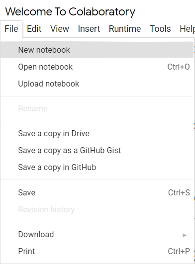
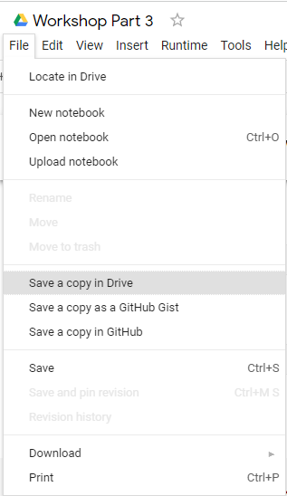

<style>
  @import url('https://fonts.googleapis.com/css2?family=Kanit:wght@300;400;700&display=swap');
    :root {
    font-family: Kanit;
}
div.colwrap {
  background-color: inherit;
  /* background-color: red; */
  color: inherit;
  width: 100%;
  height: 100%;
  position: relative;
}
/* div.colwrap div h1:first-child, div.colwrap div h2:first-child {
  margin-top: 0px !important;
} */
div.colwrap div.left {
  position: absolute;
  top: 0;
  bottom: 0;
  padding: 0px 0px 0px 0px;
}

div.colwrap div.right {
  position: absolute;
  top: 0;
  bottom: 0;
  padding: 0px 0px 0px 0px;
  /* display:flex;
  flex-direction: row;
  align-items: center; */
}

div.colwrap div.left {
/* background-color: green; */
  right: 53%;
  left: 0;
}
div.colwrap div.right {
  left: 50%;
  right: 0;
}
</style>

<!-- Slide Start -->

# Workshop Part 3

## Descriptive Analysis Using Python

---

# Python

- หนึ่งในภาษาโปรแกรมระดับสูงที่ใช้กันอย่างแพร่หลาย
- ถูกออกแบบเพื่อให้มีโครงสร้างและไวยากรณ์ของภาษาที่ไม่ซับซ้อน เข้าใจง่าย
- มีการใช้พัฒนาแอปพลิเคชัน เว็บไซต์ รวมถึงแอปบนมือถือหรือ อุปกรณ์เคลื่อนที่

---

# Python in Data Science

เหตุผลที่ Python เป็นเครื่องมือด้าน Data Science ที่ยอดนิยมคือ

- เขียนโปรแกรมได้หลากหลายประเภท โดยไม่ได้จำกัดอยู่ที่งานเฉพาะทางใดทางหนึ่ง
  - General-purpose language
- มี Libraries ยอดนิยมอย่าง `NumPy`, `Pandas`, และ `Scikit Learn`
- สามารถทำงานได้หลากหลายระบบปฏิบัติ
  - UNIX, Linux, Mac และ Windows

---

# Python Code

```python
print("Hello World")
```

---

# Python Environment

- คอมพิวเตอร์ส่วนตัว
  - รันจากไฟล์ `.py`
  - รันแบบเชิงโต้ตอบ (Interactive)
- คลาวด์ คอมพิวติ้ง
  - Google Colab

---

# Get Started with Google Colab

- ไปที่
  - https://colab.research.google.com/
  - อาจจะต้อง Sign In เข้า Google Account
- สร้าง Notebook ใหม่
  - `File` -> `New notebook`
- พิมพ์ Code
  - `print("Hello World")`
- กดปุ่ม ▶️



---

# การคัดลอก Notebook ของผู้อื่น



- เปิด Notebook ของผู้อื่น
- `File` -> `Save a copy in Drive`
- จะมี Notebook อยู่ใน Drive ของท่าน
